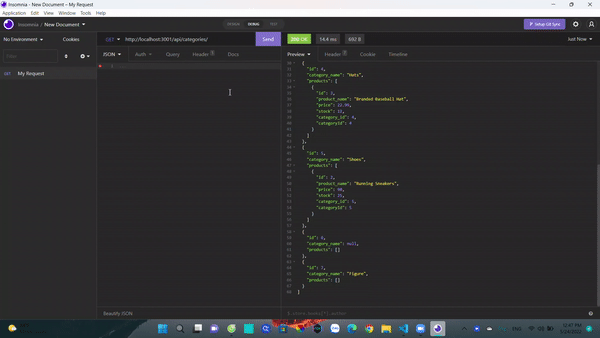

# E-Commerce-Back-End

## Badge


## Title
E-Commerce-Back-End

## Table of Contents
  - [Title](#title)
  - [Badge](#badge)
  - [Title](#title-1)
  - [Table of Contents](#table-of-contents)
  - [User Story](#user-story)
  - [Description](#description)
  - [Mock-Up](#mock-up)
  - [Tech](#tech)
  - [License](#license)
  - [Link](#link)
  - [Contact](#contact)

## User Story
```
AS A manager at an internet retail company
I WANT a back end for my e-commerce website that uses the latest technologies
SO THAT my company can compete with other e-commerce companies
```

## Description
```
GIVEN a functional Express.js API
WHEN I add my database name, MySQL username, and MySQL password to an environment variable file
THEN I am able to connect to a database using Sequelize
WHEN I enter schema and seed commands
THEN a development database is created and is seeded with test data
WHEN I enter the command to invoke the application
THEN my server is started and the Sequelize models are synced to the MySQL database
WHEN I open API GET routes in Insomnia for categories, products, or tags
THEN the data for each of these routes is displayed in a formatted JSON
WHEN I test API POST, PUT, and DELETE routes in Insomnia
THEN I am able to successfully create, update, and delete data in my database
```
## Mock-Up
The following image shows the web application's appearance:



## Tech
- [HTML](https://developer.mozilla.org/en-US/docs/Web/HTML)
- [CSS](https://developer.mozilla.org/en-US/docs/Web/CSS)
- [Javascript](https://developer.mozilla.org/en-US/docs/Web/javascript)
- [Express.js](https://expressjs.com/)
- [Node.js](https://nodejs.org/en/)
- [Sequelize](https://sequelize.org/)
- [MySQL2](https://www.npmjs.com/package/mysql2)
- [Env Var](https://www.npmjs.com/package/env-var)
- [Insomnia](https://insomnia.rest/)

## License
[MIT License](LICENSE)

## Link
[Github](https://github.com/minhkhoinguy/Employee-Tracker)

[Deploy Video]([https://](https://drive.google.com/drive/folders/1zjYQ6wzAyDiO9GpZMuO344EzKAptAtib?usp=sharing))

## Contact
Contact me with the link below if you have any questions!

[Github page](https://github.com/minhkhoinguy)

[Email](mailto:minhkhoinguy@gmail.com)

[LinkedIn](https://www.linkedin.com/in/minhkhoi-nguyen-3a8b82237/)
